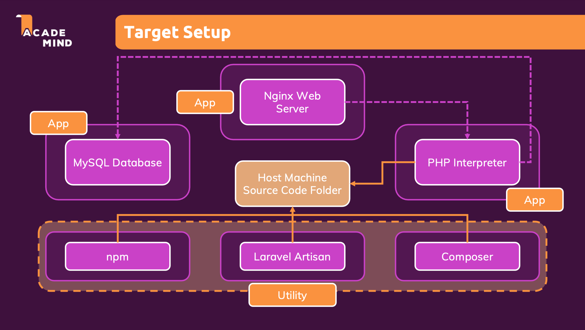

# Complex Multi-Container Laravel Application

This project demonstrates a more complex Docker setup for a Laravel application with multiple interconnected services. It showcases advanced Docker concepts including multi-container orchestration, service dependencies, and specialized utility containers.

## Project Overview

This is a complete Laravel development environment that:
1. Runs a Laravel application with Nginx and PHP-FPM
2. Uses MySQL for database storage
3. Provides utility containers for Composer, Artisan, and npm
4. Demonstrates proper container communication and networking

## Architecture Components



### Core Services

#### 1. Nginx Web Server (`server`)
- Based on `nginx:stable-alpine`
- Serves as the HTTP server and entry point
- Routes dynamic requests to PHP-FPM
- Directly serves static files
- Configured to point to Laravel's `public/` directory

#### 2. PHP-FPM (`php`)
- Based on `php:8.2.4-fpm-alpine`
- Executes the Laravel application code
- Includes PDO and MySQL extensions
- Communicates with Nginx via FastCGI

#### 3. MySQL Database (`mysql`)
- Based on `mysql:5.7`
- Stores persistent application data
- Environment variables loaded from `./env/mysql.env`

### Utility Services

#### 4. Composer (`composer`)
- Based on `composer:2.5.7`
- PHP dependency manager
- Used to install and update PHP packages
- Runs with `--ignore-platform-reqs` flag to avoid environment conflicts

#### 5. Artisan (`artisan`)
- Based on the same PHP image as the main service
- Laravel's command-line interface
- Used for migrations, seeding, and other Laravel-specific tasks

#### 6. npm (`npm`)
- Based on `node:14-alpine`
- Used for frontend asset compilation
- Manages JavaScript dependencies and build processes

## Docker Concepts Demonstrated

This project showcases several advanced Docker concepts:

### 1. Multi-Container Architecture
- Separation of concerns with specialized containers
- Proper service isolation and communication

### 2. Volume Management
- Code sharing between containers via volumes
- Persistent database storage
- Read-only volume mounts where appropriate

### 3. Custom Dockerfiles
- Specialized images for different services
- Multi-stage builds for optimized containers

### 4. Service Dependencies
- Container orchestration with `depends_on`
- Proper startup order management

### 5. Utility Containers
- Purpose-built containers for specific tasks
- Ephemeral containers that run and exit

## Docker Commands

### Starting the Application

```bash
# Start all services
docker compose up -d

# Start only specific services
docker compose up -d server php mysql
```

### Using Utility Containers

```bash
# Install PHP dependencies
docker compose run --rm composer install

# Run database migrations
docker compose run --rm artisan migrate

# Install npm dependencies
docker compose run --rm npm install

# Compile frontend assets
docker compose run --rm npm run dev
```

### Viewing Logs

```bash
# View logs from all containers
docker compose logs

# View logs from specific container
docker compose logs php

# Follow logs in real-time
docker compose logs -f
```

### Stopping the Application

```bash
# Stop all containers
docker compose down

# Stop and remove volumes (caution: destroys database)
docker compose down -v
```

## Development Workflow

### Initial Setup

1. Navigate to the project directory:
   ```bash
   cd /path/to/project/07_complex_multi_container_app
   ```

2. Create a new Laravel project using the Composer utility container (one-time setup only):
   ```bash
   docker compose run --rm composer create-project --prefer-dist laravel/laravel .
   ```
   > Note: This step is only required once when initially setting up the project. Skip this step if the Laravel project already exists.

3. Create MySQL environment file:
   ```bash
   mkdir -p env
   touch env/mysql.env
   ```
   
   Add the following content to `env/mysql.env`:
   ```
   MYSQL_DATABASE=homestead
   MYSQL_USER=homestead
   MYSQL_PASSWORD=secret
   MYSQL_ROOT_PASSWORD=secret
   ```

4. Configure the database connection in the `.env` file:
   - If you created a new project with the command above, a `.env` file is already created
   - If you cloned an existing project, copy `.env.example` to `.env`
   - Either way, ensure these database connection settings are configured:
   
   ```
   DB_CONNECTION=mysql
   DB_HOST=mysql
   DB_PORT=3306
   DB_DATABASE=homestead
   DB_USERNAME=homestead
   DB_PASSWORD=secret
   ```
   
   > Note: The DB_HOST must be set to "mysql" which is the service name in docker-compose.yaml

5. Start the containers (with optional rebuild):
   ```bash
   # Start all three main services with optional rebuild
   docker compose up -d server php mysql --build
   
   # Alternatively, since others are dependencies of server:
   docker compose up -d server --build
   ```

6. Run migrations to create database tables (Laravel 12+ defaults to SQLite, so we need to migrate to MySQL):
   ```bash
   docker compose run --rm artisan migrate
   ```
   > Note: This step is crucial as Laravel 12+ defaults to using SQLite (flat storage). This command migrates the data structure to our MySQL database.

7. Cache views for improved performance:
   ```bash
   docker compose run --rm artisan view:cache
   ```

8. Generate application encryption key (required for Laravel 12+):
   ```bash
   docker compose run --rm artisan key:generate
   ```
   > Note: This step is mandatory for Laravel 12+ and ensures secure encryption for cookies, sessions, and other encrypted data.

9. Install frontend dependencies:
   ```bash
   docker compose run --rm npm install
   ```

10. Compile assets:
    ```bash
    docker compose run --rm npm run dev
    ```

### Daily Development

1. Start containers:
   ```bash
   docker compose up -d server
   ```

## Why Use This Containerized Approach?

This multi-container setup offers several key advantages:

1. **Development Environment Isolation**:
   - Run complex development environments without installing PHP, MySQL, Nginx, or Node.js on your local machine
   - Avoid conflicts between different versions of the same software for different projects
   - Ensure consistent environments across all development machines

2. **Simplified Onboarding**:
   - New team members can start development with minimal setup
   - "It works on my machine" problems are eliminated
   - No need to follow complex installation guides for each technology

3. **Production-Like Development**:
   - Development environment closely mirrors production setup
   - Catch environment-specific issues early in development
   - Test container interactions before deployment

4. **Specialized Service Configuration**:
   - Each service is optimally configured for its specific role
   - Services can be scaled or replaced independently
   - Configuration is version-controlled alongside code

5. **Efficient Resource Usage**:
   - Services run only when needed
   - Utility containers (Composer, Artisan, npm) run and exit
   - No need to keep development services running permanently on your machine

This approach particularly shines for complex applications like Laravel that require multiple interconnected services to function properly.

## Service Interactions

This setup demonstrates the following service interactions:

1. **HTTP Request Flow**:
   - Client → Nginx → PHP-FPM → MySQL (if database access needed)
   - Nginx serves static assets directly

2. **Development Workflow**:
   - Host machine (source code) → Shared volumes → All containers
   - Utility containers (Composer, npm, Artisan) → Source code

## Configuration Details

### Nginx Configuration

Nginx is configured to:
- Listen on port 80 (mapped to host port 8000)
- Serve the Laravel public directory
- Pass PHP requests to the PHP-FPM service
- Handle Laravel's pretty URLs with proper rewrites

### PHP Configuration

The PHP container:
- Uses PHP 8.2.4 with FPM on Alpine Linux
- Has MySQL extensions installed
- Runs with proper permissions (www-data)

### MySQL Configuration

MySQL is configured via environment variables in `./env/mysql.env` including:
- Database name
- Root password
- User credentials

## Troubleshooting

### Common Issues

1. **Database connection errors**:
   - Ensure MySQL container is running: `docker compose ps`
   - Check MySQL environment variables match Laravel's `.env` file
   - Wait a few seconds for MySQL to initialize fully

2. **Permission issues**:
   - Ensure the `src` directory has proper permissions
   - The PHP container runs as www-data user

3. **Missing dependencies**:
   - Run `docker compose run --rm composer install`
   - Run `docker compose run --rm npm install`

4. **Laravel errors**:
   - Check logs: `docker compose logs php`
   - Ensure `.env` file exists in the `src` directory
   - Generate app key: `docker compose run --rm artisan key:generate`

### Resolving "Connection refused" MySQL Errors

If you encounter this error:
```
SQLSTATE[HY000] [2002] Connection refused (Connection: mysql, SQL: select * from `sessions` where `id` = ...)
```

Follow these steps to resolve it:

1. **Verify all containers are running**:
   ```bash
   docker compose ps
   ```
   Make sure the MySQL container shows as "running" and not restarting or exited.

2. **Check if the database was created**:
   ```bash
   docker compose exec mysql mysql -u root -p -e "SHOW DATABASES;"
   ```
   Enter the MySQL root password when prompted (default is "secret").
   You should see your database (default "homestead") in the list.

3. **Run migrations again**:
   ```bash
   docker compose run --rm artisan migrate
   ```

4. **Verify database connection settings**:
   Ensure these settings in your `src/.env` file match your MySQL environment variables:
   ```
   DB_CONNECTION=mysql
   DB_HOST=mysql
   DB_PORT=3306
   DB_DATABASE=homestead
   DB_USERNAME=homestead
   DB_PASSWORD=secret
   ```
   The most common issue is using "localhost" instead of "mysql" for DB_HOST.

5. **Check MySQL logs**:
   ```bash
   docker compose logs mysql
   ```
   Look for any error messages that might indicate why the connection is failing.

6. **Restart the containers**:
   ```bash
   docker compose down
   docker compose up -d
   ```

7. **Clear Laravel's cache**:
   ```bash
   docker compose run --rm artisan config:clear
   docker compose run --rm artisan cache:clear
   ```

If the issue persists, try rebuilding the containers:
```bash
docker compose down
docker compose up -d --build
```

### Resolving "Table doesn't exist" Errors

If you encounter an error like:
```
SQLSTATE[42S02]: Base table or view not found: 1146 Table 'homestead.sessions' doesn't exist
```

This means your database connection is working, but the required tables haven't been created. Follow these steps:

1. **Run Laravel migrations**:
   ```bash
   docker compose run --rm artisan migrate
   ```

2. **If you're using Laravel's session database driver**, specifically run the session table migration:
   ```bash
   docker compose run --rm artisan session:table
   docker compose run --rm artisan migrate
   ```

3. **If you need to reset and recreate all tables**:
   ```bash
   docker compose run --rm artisan migrate:fresh
   ```
   Warning: This will drop all tables and recreate them, losing any data.

4. **Check your Laravel session configuration**:
   Make sure your session driver in `src/.env` is configured correctly:
   ```
   SESSION_DRIVER=file
   ```
   If you want to use the database for sessions, change it to:
   ```
   SESSION_DRIVER=database
   ```
   And then run the session table migration as shown above.

### Ensuring Data Persistence Between Container Restarts

If you find that you need to run migrations or regenerate keys after restarting containers, it's likely due to data persistence issues. The docker-compose.yaml file includes named volumes to address this:

```yaml
volumes:
  mysql-data:                # Persists MySQL database data
  laravel-cache:             # Persists Laravel cache files
  laravel-views:             # Persists compiled views
  laravel-sessions:          # Persists sessions
```

These volumes ensure that:
1. Your database tables and data remain intact between container restarts
2. Laravel's cached views, sessions, and other framework files persist

If you're still experiencing issues after container restarts, verify that these volumes are being created correctly:

```bash
docker volume ls | grep laravel
```

You should see the named volumes listed in the output.
